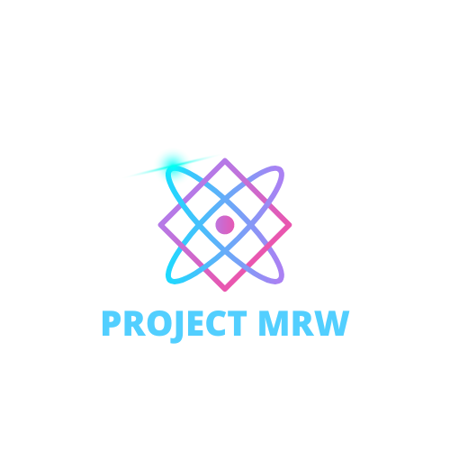

<!-- PROJECT LOGO -->
<br />
<div align="center">
  <a href="https://github.com/github_username/repo_name">
    
  </a>
<h1 align="center">Inventory-Tracker</h1>
</div>

<!-- TABLE OF CONTENTS -->
<details>
  <summary>Table of Contents</summary>
  <ol>
    <li>
      <a href="#about-the-project">About The Project</a>
      <ul>
        <li><a href="#built-with">Built With</a></li>
      </ul>
    </li>
    <li>
      <a href="#getting-started">Getting Started</a>
      <ul>
        <li><a href="#prerequisites">Prerequisites</a></li>
        <li><a href="#installation">Installation</a></li>
      </ul>
    </li>
    <li><a href="#usage">Usage</a></li>
    <li><a href="#license">License</a></li>
    <li><a href="#contact">Contact</a></li>
    <li><a href="#acknowledgments">Acknowledgments</a></li>
  </ol>
</details>


<!-- ABOUT THE PROJECT -->
## About The Project

Inventory Manager

Looking to make tracking inventories on the backend a breeze? Fork a clone of our express inventory manager connected to your own personal mongo database for storing your own products. Product Uploads made simple,create, edit, delete, and dynamically render your items on your own backend tool


<p align="right">(<a href="#readme-top">back to top</a>)</p>


### Built With

* [![Node][Node.js]][Next-url]
* [![Express][Express]][React-url]
* [![Handlebars][Handlebars]][Handlebars-url]
* [![JQuery][JQuery.com]][JQuery-url]

<p align="right">(<a href="#readme-top">back to top</a>)</p>


<!-- GETTING STARTED -->
## Getting Started

To get started simply, create a new folder on your desktop (name it anything you want), copy the link to the main branch for Inventory Manager "https://github.com/Flintryan82/Inventory-Manager", Open your new folder in vs code and perform a git clone on the url given. Once everything is cloned in you should be given a file named "Inventory-Manager"

In a new terminal type "cd Inventory-Manager"(this should take you into the proper file destination in your terminal)
In the Inventory-Manager directory, perform your npm install to download all the dependencies listed in the package.json.

Once npm installs complete, your last task is to start up the server, simply type
"npm start" into your terminal.

This will launch your app on your own local server, files should be ready to be viewed in your local host on the port 5000. 

in your search enginer type "https://localhost:5000"

### Prerequisites

You will need to install mongosh

please review mongosh documentations to get a local database on your server for storing products. 

mongoDBcompass

configure mongodb files in program files 

run mongod before sending and CRUD requests!

### Installation

1. Clone the repo
   ```sh
   git clone website
   ```
2. Install NPM packages
   ```sh
   npm install
   ```
3. Change into proper directory
  ```sh
  cd Inventory-Manager
   ```
4. Start Development Server
  ```sh
  npm start
  ```

<p align="right">(<a href="#readme-top">back to top</a>)</p>


<!-- USAGE EXAMPLES -->
## Usage

Inventory-Manager has a variety of uses. Pretend you are a mom and pop fighing shop that sells custom items. Unlike commercialized products your items wont be boxed, with a proper SKU number.
To go around this problem we created the Express Inventory Manager in order to easily help users manage their small scale inventories in a simple to use manner. 

Simply type the product information in a form, and send that product to your own personal database for storage. This information is kept so on your home page, you get to view all of your products along with their price, quantity, vendor, and descriptions etc. 

_For more examples, please refer to the [Documentation](https://example.com)_

<p align="right">(<a href="#readme-top">back to top</a>)</p>


<!-- LICENSE -->
## License

Distributed under the MIT License. See `LICENSE.txt` for more information.

<p align="right">(<a href="#readme-top">back to top</a>)</p>


<!-- CONTACT -->
## Contact

* [M.A](Michael Allen)
email:
website
* [R.F](Ryan Flint)
email:
website
* [W.B](William Bermudez)
email:
website:

Project Link: [https://github.com/Flintryan82/Inventory-Manager](https://github.com/Flintryan82/Inventory-Manager)

<p align="right">(<a href="#readme-top">back to top</a>)</p>


<!-- ACKNOWLEDGMENTS -->
## Acknowledgments

* [M.A](Michael Allen)
* [R.F](Ryan Flint)
* [W.B](William Bermudez)

<p align="right">(<a href="#readme-top">back to top</a>)</p>

